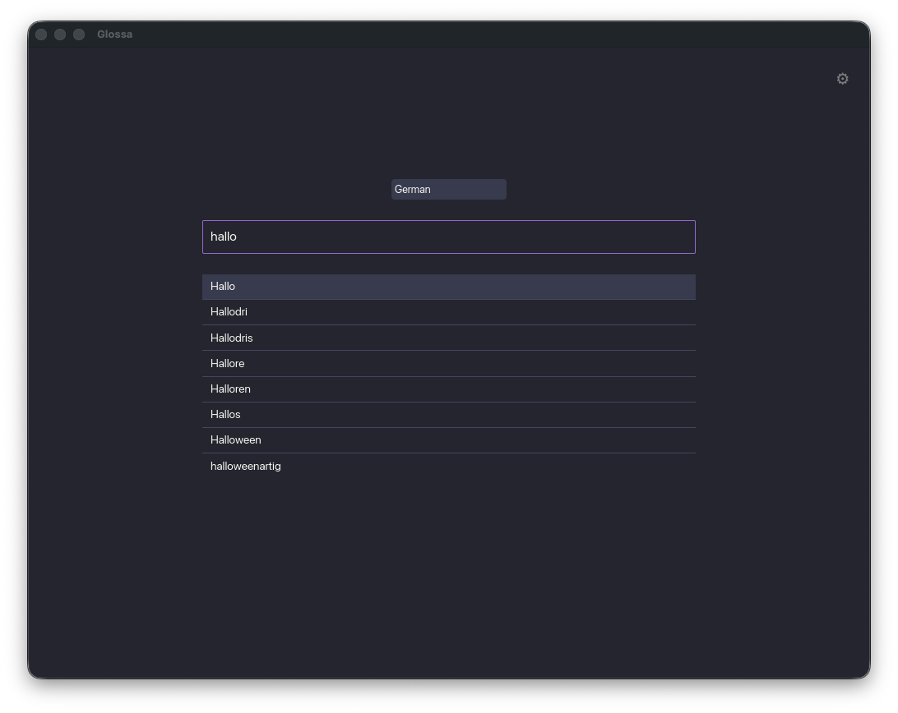
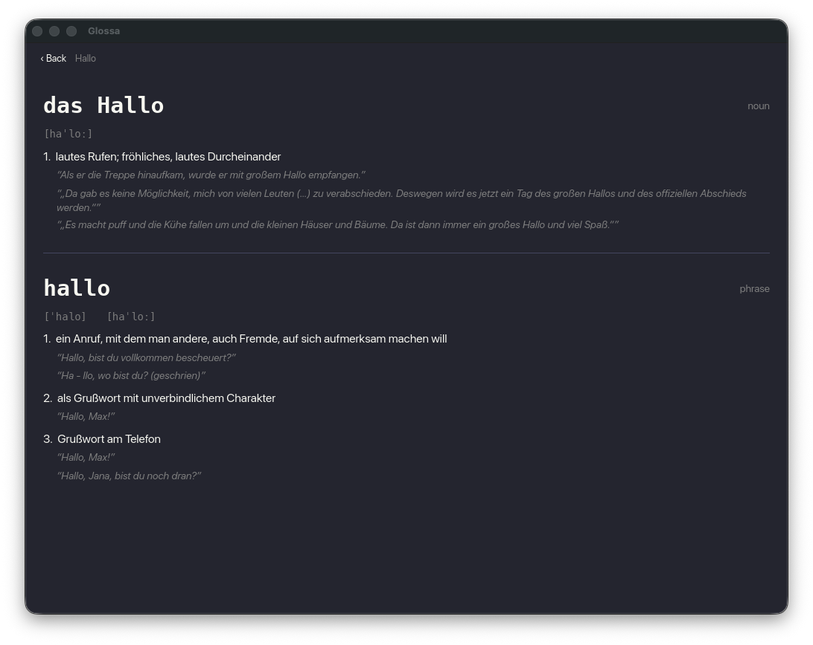
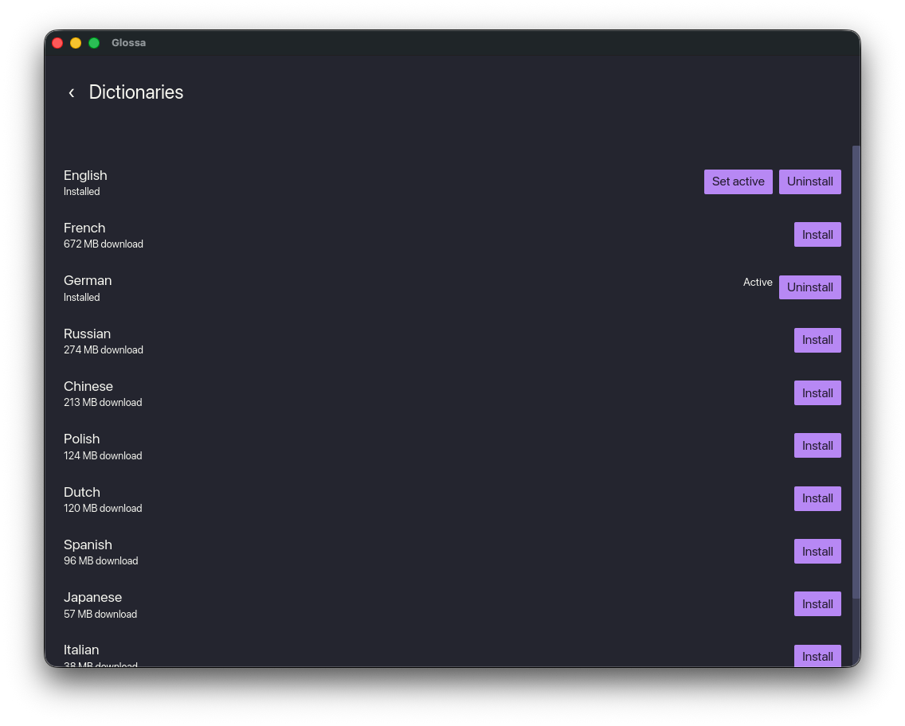

# Glossa

An offline, multi-edition dictionary desktop app. Install a Wiktionary edition once, then look up words with no network access — fast, local, and searchable across every headword language that edition defines.

Built in Rust with [`iced`](https://iced.rs/), backed by per-edition SQLite databases sourced from [kaikki.org](https://kaikki.org/) Wiktextract dumps.

## Screenshots

|                                    Search                                    |                                    Result                                    |                                    Dictionaries                                     |
| :---------------------------------------------------------------------------: | :---------------------------------------------------------------------------: | :-----------------------------------------------------------------------------------: |
|  |  |  |

## Features

- **Offline lookups.** Each installed edition is a self-contained SQLite database. No network needed after install.
- **Multiple editions.** Install English, French, German, Russian, Chinese, Polish, Dutch, Spanish, Japanese, Italian, or Portuguese — and switch the active one in Settings.
- **In-app installer.** Downloads and builds an edition's database in the background, with live download and import progress.
- **Headword-language switcher.** Each edition contains entries for many languages; pick which one you're searching (shown when an edition defines more than one).
- **Live search suggestions.** Prefix autocomplete appears as you type. Navigate it with `↑`/`↓`; `Enter` looks up whichever suggestion is highlighted (the first match by default), or click one directly.
- **Cross-reference navigation.** Click a related-word link inside an entry to jump to it, with a Back button and a breadcrumb trail back through everywhere you've been.
- **Grammatical detail.** Where the source data records it, an entry shows its definite article ahead of the headword (e.g. German "**das** Hallo") rather than just the bare word.

## Requirements

- Rust toolchain (edition 2024 — Rust 1.85+).
- Disk space for editions. Compressed downloads range from ~33 MB (Portuguese) to 2.6 GB (English); the built database is larger.

`rusqlite` is built with the `bundled` feature, so no system SQLite is required.

## Build & Run

```sh
cargo run --release
```

Release mode is recommended — imports parse large JSONL dumps and run much faster optimized.

## Usage

1. Launch the app. On first run no dictionary is installed.
2. Open **Settings** via the gear icon on the Search screen.
3. Pick an edition and **Install**. It downloads and builds the database; progress is shown inline. The first installed edition is activated automatically.
4. Back on **Search**, type a word — suggestions appear live below the box. Press `Enter` or click one to look it up.
5. Click related words inside an entry to follow cross-references; use **Back** or a breadcrumb to retrace your steps.

## Keyboard shortcuts

| Key        | Action                                              |
| ---------- | ---------------------------------------------------- |
| `Esc`      | Return to the Search screen                          |
| `Ctrl+,`   | Open Settings                                        |
| `↑` / `↓`  | Move the highlight through search suggestions        |
| `Enter`    | Look up the highlighted suggestion (or typed word)    |

> On macOS, `Cmd` substitutes for `Ctrl`.

## Data layout

App data lives under the OS data directory (`%APPDATA%/glossa` on Windows; the platform data dir elsewhere; falls back to `./data`):

- `<data_dir>/{code}.db` — one SQLite database per installed edition (e.g. `en.db`).
- `<data_dir>/settings.json` — active edition, active language.

Uninstalling an edition deletes its `.db` file.

## Architecture

The crate splits into a GUI binary and a UI-independent library.

- `src/main.rs` — the `iced` application: state, `Message` handling, `update`, all three screens (Search, Result, Settings), and the keyboard subscription. The only part that depends on `iced`.
- `src/lib.rs` — library root re-exporting the modules below.
- `src/db.rs` — SQLite schema, read-only/writable open helpers, language-scoped lookup, prefix autocomplete, language list.
- `src/importer.rs` — downloads an edition's `.jsonl.gz` dump and builds its database, streaming `Progress` off the UI thread.
- `src/paths.rs` — on-disk locations for databases and settings.
- `src/model/` — `catalog` (installable editions + language names), `entry` (the `Entry`/`Sense`/`Form` types deserialized from and re-serialized into the database), `library` (installed-edition state + persisted settings).

### How an edition is stored

Each edition's dump is parsed line by line into an `entries` table (`word`, normalized `word_norm`, `lang_code`, `pos`, full JSON `data`). Rows are batched into multi-row `INSERT`s inside a single transaction, with journaling and sync disabled for the duration of the import — safe here since a fresh database is rebuilt from scratch on failure rather than needing to survive a crash mid-write. A `languages` table records per-language entry counts for the switcher. The lookup index `(lang_code, word_norm)` is built after bulk insert for speed, and prefix search uses a half-open range over it so cost is independent of how many words match.

## Tests

```sh
cargo test
```

See `tests/db_lookup.rs`.

## Data source & licensing

Dictionary data comes from [kaikki.org](https://kaikki.org/) Wiktextract extracts of Wiktionary. It's community-edited rather than professionally curated, so depth and consistency vary by language edition and entry. Wiktionary content is licensed under CC BY-SA and GFDL; review those terms for any redistribution.
